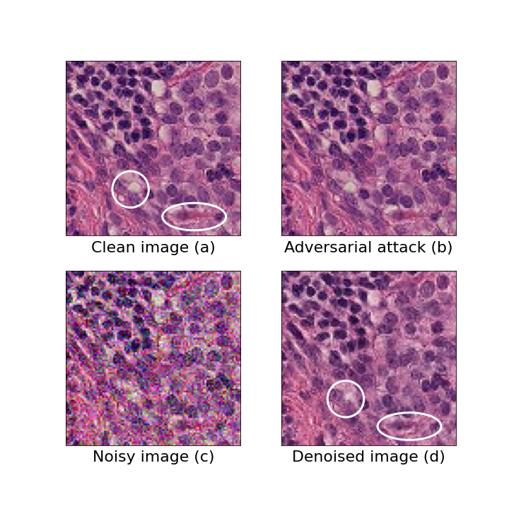

# Denoising Diffusion Probabilistic Models as a Defense against Adversarial Attacks

> Lars Ankile, Anna Midgley, Sebastian Weisshaar, Harvard University, 2022

This repository contains the code to reproduce the experiments and results in the paper. For any questions, reach out to larsankile@g.harvard.edu or open an issue in the repo. Read the final report in the [PDF located in the repo](MIT_6_7900_Final_Project.pdf).

**Abstract**

_Neural Networks are infamously sensitive to small perturbations in their inputs, making them vulnerable to adversarial attacks. This project evaluates the performance of Denoising Diffusion Probabilistic Models (DDPM) as a purification technique to defend against adversarial attacks. This works by adding noise to an adversarial example before removing it through the reverse process of the diffusion model. We evaluate the approach on the PatchCamelyon data set for histopathologic scans of lymph node sections and find an improvement of the robust accuracy by up to 88\% of the original model's accuracy, constituting a considerable improvement over the vanilla model and our baselines._

**Selected Figures**

An example of a tissue sample in the different stages of the model pipeline.

The results of running our four models on 1000 test samples for both standard accuracy (left) and robust accuracy (right). The vanilla `ResNet` model is red, and our method is purple. It is also important to note that the robust adversarially trained model is an instance of a `GoogLeNet`, and not `ResNet`, as this was the only tested architecture that generalized under adversarial training.

